<!--
Configuration
=============
- Every slide taken "directly from the PDF" shows a given page of
  presentation_base.pdf as a pre-rendered JPG via
  .
  This used to be a live <iframe> straight into the PDF, but mobile
  browsers (iOS Safari, Android Chrome) have no built-in PDF viewer plugin
  for iframes — they just showed a fallback "open presentation_base.pdf"
  link there instead of the page. Pre-rendered images work everywhere.
  This DOES mean the images go stale when presentation_base.pdf changes —
  run `python3 marp/render_pdf_pages.py` afterwards to regenerate every
  pdf_pages/page-N.jpg referenced by a data-pdf-page="N" attribute below.
- To choose which pages appear, just add/remove/reorder the slides below —
  each one is a single  line,
  plus the slide-class comment above it. After adding/removing a page
  number, rerun render_pdf_pages.py so its JPG exists.
- presentation_base.pdf currently has 31 pages. Page 1 is the title slide,
  page 31 is the closing "Vielen Dank" slide — every page in between (2-30)
  is shown here, in order. One extra slide (the "Autofreie Zonen" carfree
  map) is inserted after page-21's slide and reuses page-12.jpg as its
  background image — that looks like a leftover copy/paste from the
  ABsurveys slide above it rather than the intended PDF page; worth
  double-checking against presentation_base.pdf and swapping in the
  correct page-N.jpg if so.
- Footer: every slide except the title and the closing "Vielen Dank" slide
  gets a left-aligned footer ("<page> | 10.07.2026 | Frankfurt University
  of Applied Sciences | Projekt Verkehr") via a per-slide "_footer: ..."
  HTML-comment directive (see theme.css for why it's not built on Marp's
  automatic page-number counter, and why the directive must be "_footer",
  not "footer" — the latter cascades to every following slide instead of
  applying to just one). <page> is this slide's position in the deck (1 =
  title), so it must be kept in sync by hand if slides are added/removed/
  reordered. Content slides also pick up a "footer-dark" class when their
  background is light (checked against the exported JPG's actual
  bottom-right corner brightness), or use the theme default (white) on the
  dark-navy / section-divider slides and on the full-bleed live-map slides
  (their bottom margin still shows the theme's navy background).
- Map overlays/slides (all map src paths are relative to this file, i.e.
  to marp/, same as everything else here — e.g. "../maps/..." resolves via
  marp/../maps/... regardless of where presentation.html itself is linked
  from, so the root index.html linking to "marp/presentation.html" needs
  no special handling):
    - .map-overlay-br: a small live map dropped over a pdf-embed image,
      bottom-right corner, ~50% of the slide's width/height.
    - .map-overlay-bc: a small live map dropped over a pdf-embed image,
      bottom-center, nearly full width (10% clear at the top, 3% margins
      elsewhere).
    - .map-frame: a near-full-slide live map (the pdf-embed image is still
      present underneath at the edges), leaving room at the bottom for the
      footer — used for slides that are essentially "just the map".
-->

<!-- _class: title -->

---

<!-- _class: pdf-page -->
<!-- _footer: "2 | 10.07.2026 | Frankfurt University of Applied Sciences | Projekt Verkehr" -->

---

<!-- _class: pdf-page footer-dark -->
<!-- _footer: "3 | 10.07.2026 | Frankfurt University of Applied Sciences | Projekt Verkehr" -->
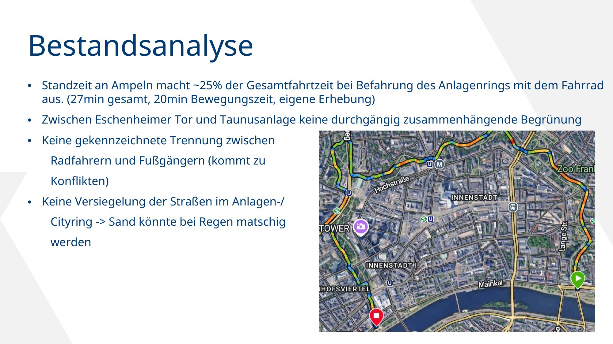

---

<!-- _class: pdf-page footer-dark -->
<!-- _footer: "4 | 10.07.2026 | Frankfurt University of Applied Sciences | Projekt Verkehr" -->
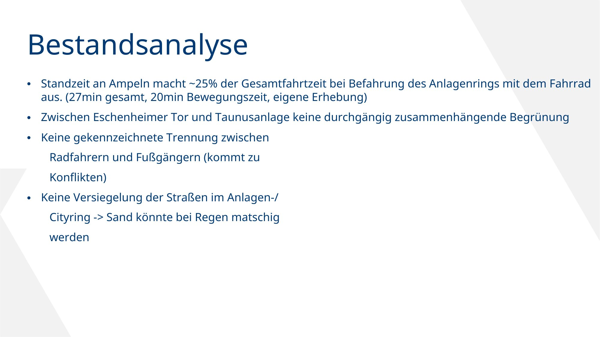

  <iframe class="map-embed" src="../maps/cycle/cycle_map.html"></iframe>

---

<!-- _class: pdf-page footer-dark -->
<!-- _footer: "5 | 10.07.2026 | Frankfurt University of Applied Sciences | Projekt Verkehr" -->
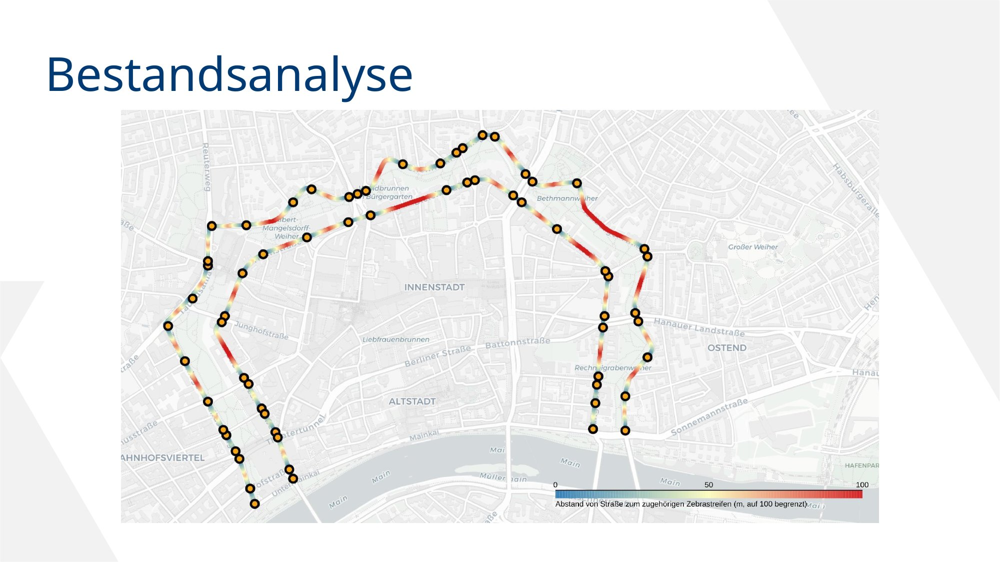

---

<!-- _class: pdf-page footer-dark -->
<!-- _footer: "6 | 10.07.2026 | Frankfurt University of Applied Sciences | Projekt Verkehr" -->

  <iframe class="map-embed" src="../maps/intersections/intersections_map.html"></iframe>

---

<!-- _class: pdf-page footer-dark -->
<!-- _footer: "7 | 10.07.2026 | Frankfurt University of Applied Sciences | Projekt Verkehr" -->
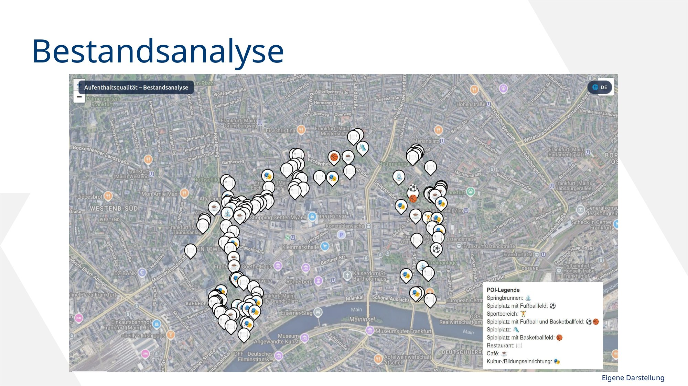

---

<!-- _class: pdf-page footer-dark -->
<!-- _footer: "8 | 10.07.2026 | Frankfurt University of Applied Sciences | Projekt Verkehr" -->

  <iframe class="map-embed" src="../maps/points_of_interest/points_of_interest.html"></iframe>

---

<!-- _class: pdf-page footer-dark -->
<!-- _footer: "9 | 10.07.2026 | Frankfurt University of Applied Sciences | Projekt Verkehr" -->
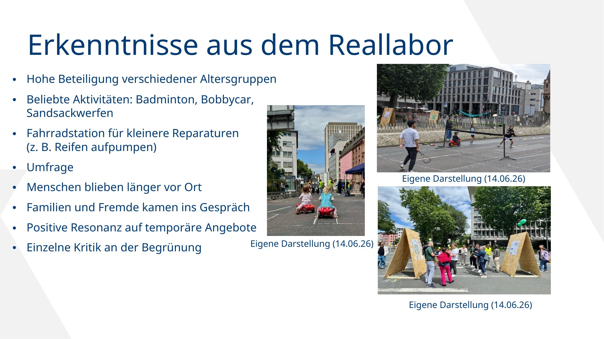

---

<!-- _class: pdf-page footer-dark -->
<!-- _footer: "10 | 10.07.2026 | Frankfurt University of Applied Sciences | Projekt Verkehr" -->
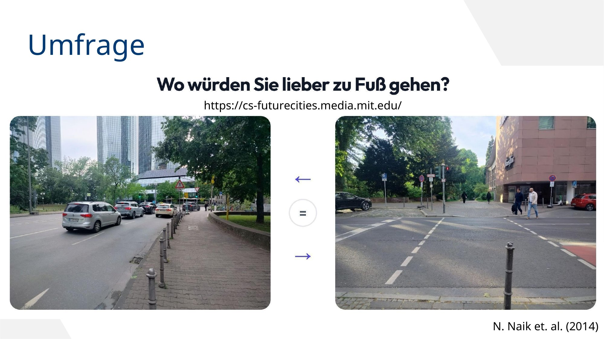

---

<!-- _class: pdf-page  footer-dark-->
<!-- _footer: "11 | 10.07.2026 | Frankfurt University of Applied Sciences | Projekt Verkehr" -->

  <iframe class="map-embed" src="https://cs-futurecities.media.mit.edu/"></iframe>

---

<!-- _class: pdf-page -->
<!-- _footer: "12 | 10.07.2026 | Frankfurt University of Applied Sciences | Projekt Verkehr" -->

  <iframe class="map-embed" src="../ABsurveys/index.html"></iframe>

---

<!-- _class: pdf-page footer-dark -->
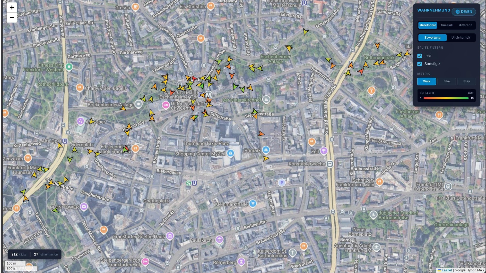

---

<!-- _class: pdf-page footer-dark -->
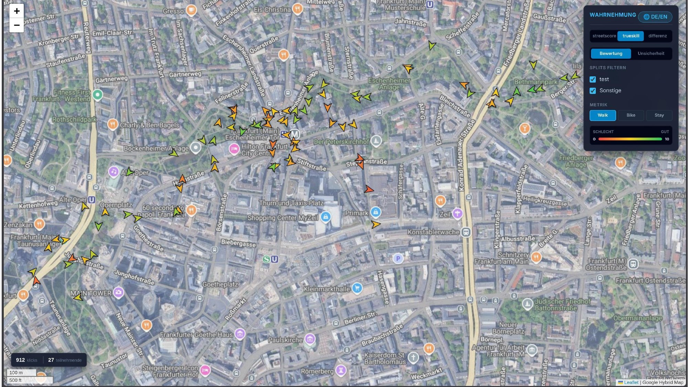

---

<!-- _class: pdf-page footer-dark -->
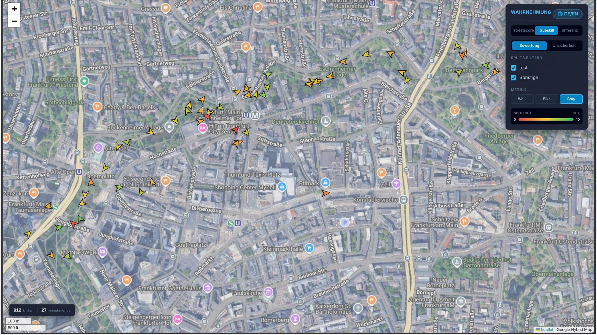

---

<!-- _class: pdf-page footer-dark -->
<!-- _footer: "16 | 10.07.2026 | Frankfurt University of Applied Sciences | Projekt Verkehr" -->
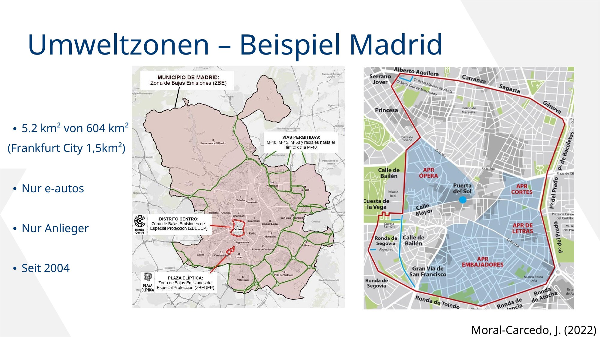

---

<!-- _class: pdf-page footer-dark -->
<!-- _footer: "17 | 10.07.2026 | Frankfurt University of Applied Sciences | Projekt Verkehr" -->
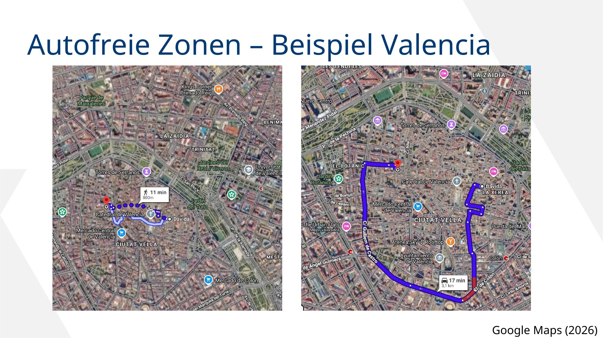

---

<!-- _class: pdf-page footer-dark -->
<!-- _footer: "18 | 10.07.2026 | Frankfurt University of Applied Sciences | Projekt Verkehr" -->
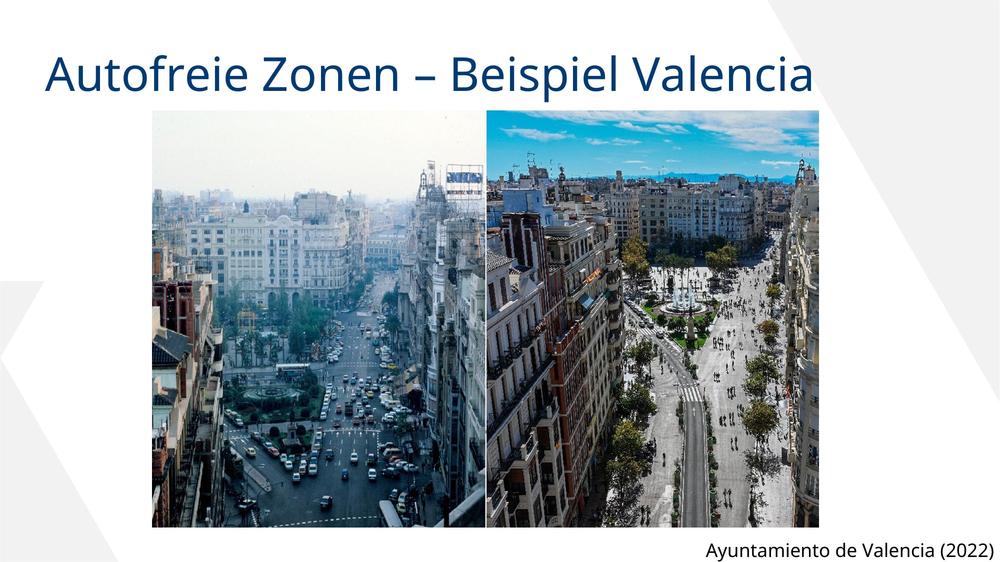

---

<!-- _class: pdf-page footer-dark -->
<!-- _footer: "19 | 10.07.2026" -->
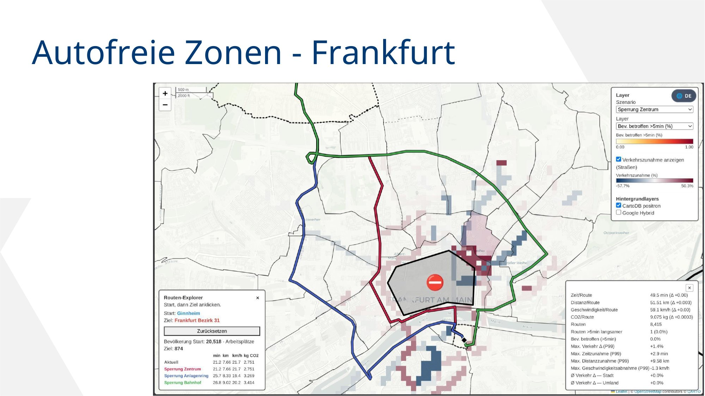

---

<!-- _class: pdf-page footer-dark -->
<!-- _footer: "20 | 10.07.2026" -->
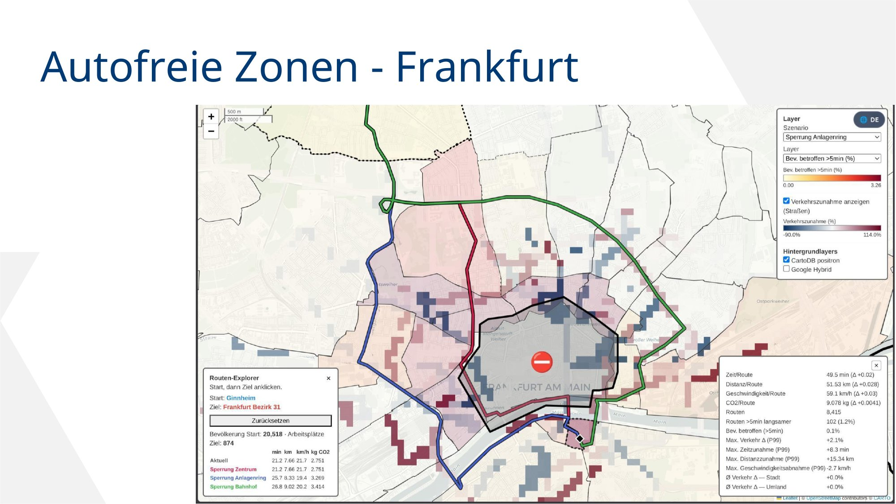

---

<!-- _class: pdf-page footer-dark -->
<!-- _footer: "21 | 10.07.2026" -->
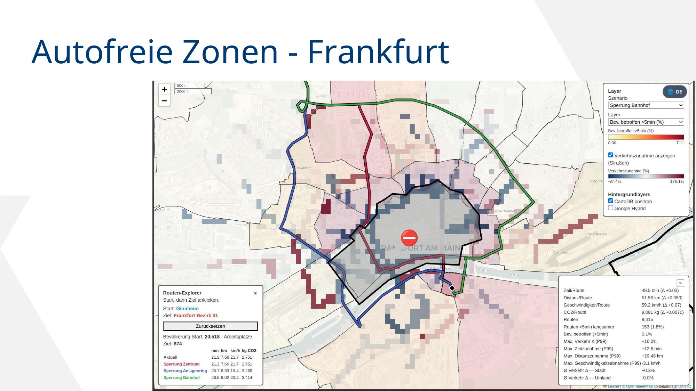

---

<!-- _class: pdf-page -->
<!-- _footer: "22 | 10.07.2026 | Frankfurt University of Applied Sciences | Projekt Verkehr" -->

  <iframe class="map-embed" src="../routing/carfree_zones_map.html"></iframe>

---

<!-- _class: pdf-page -->
<!-- _footer: "23 | 10.07.2026 | Frankfurt University of Applied Sciences | Projekt Verkehr" -->

---

<!-- _class: pdf-page -->
<!-- _footer: "24 | 10.07.2026 | Frankfurt University of Applied Sciences | Projekt Verkehr" -->
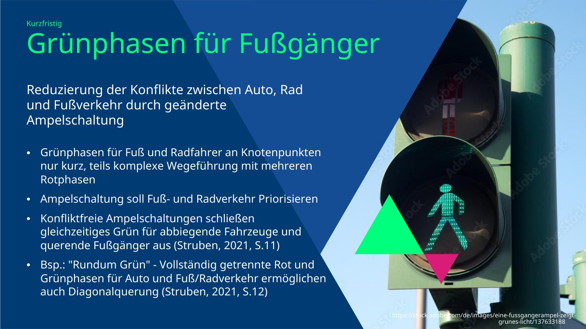

---

<!-- _class: pdf-page -->
<!-- _footer: "25 | 10.07.2026 | Frankfurt University of Applied Sciences | Projekt Verkehr" -->
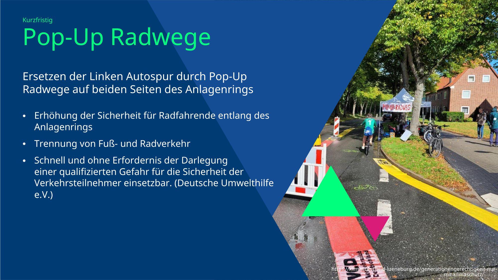

---

<!-- _class: pdf-page footer-dark -->
<!-- _footer: "26 | 10.07.2026 | Frankfurt University of Applied Sciences | Projekt Verkehr" -->
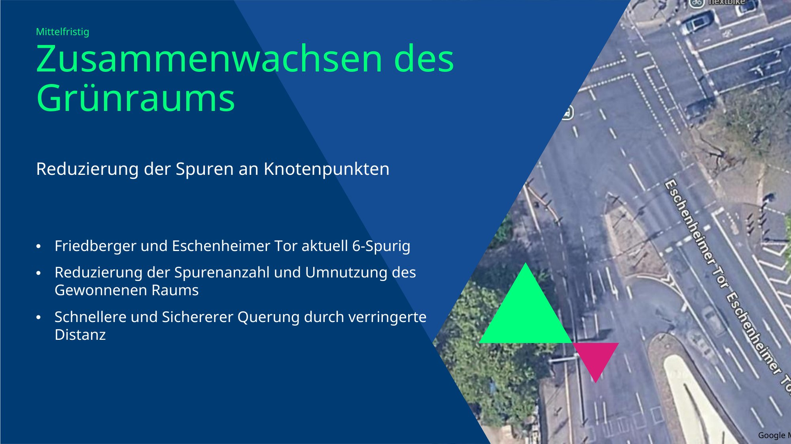

---

<!-- _class: pdf-page -->
<!-- _footer: "27 | 10.07.2026 | Frankfurt University of Applied Sciences | Projekt Verkehr" -->
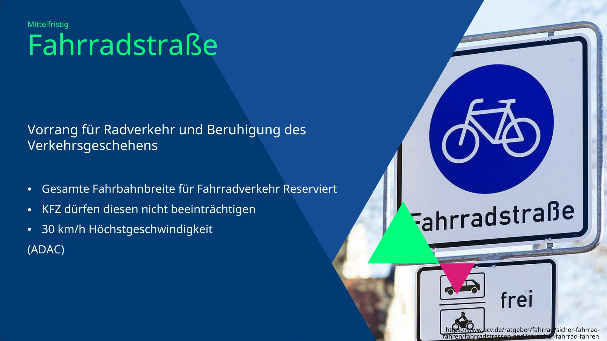

---

<!-- _class: pdf-page -->
<!-- _footer: "28 | 10.07.2026 | Frankfurt University of Applied Sciences | Projekt Verkehr" -->

---

<!-- _class: pdf-page footer-dark -->
<!-- _footer: "29 | 10.07.2026 | Frankfurt University of Applied Sciences | Projekt Verkehr" -->
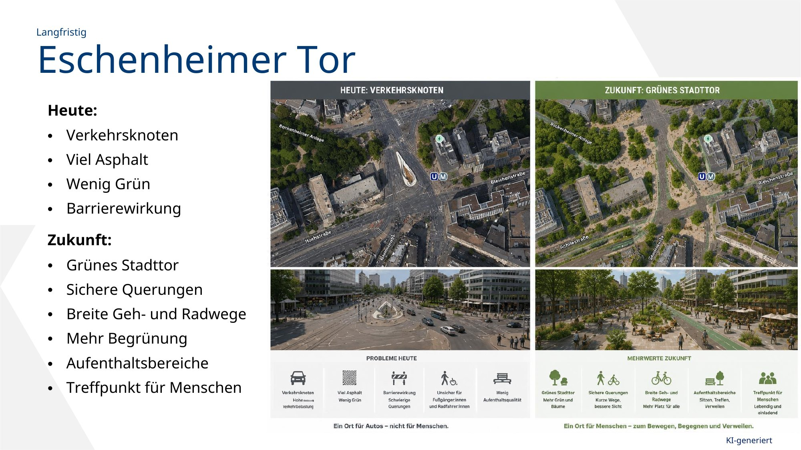

---

<!-- _class: pdf-page -->
<!-- _footer: "30 | 10.07.2026 | Frankfurt University of Applied Sciences | Projekt Verkehr" -->
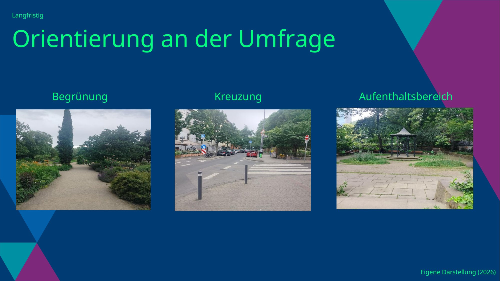

---

<!-- _class: pdf-page footer-dark -->

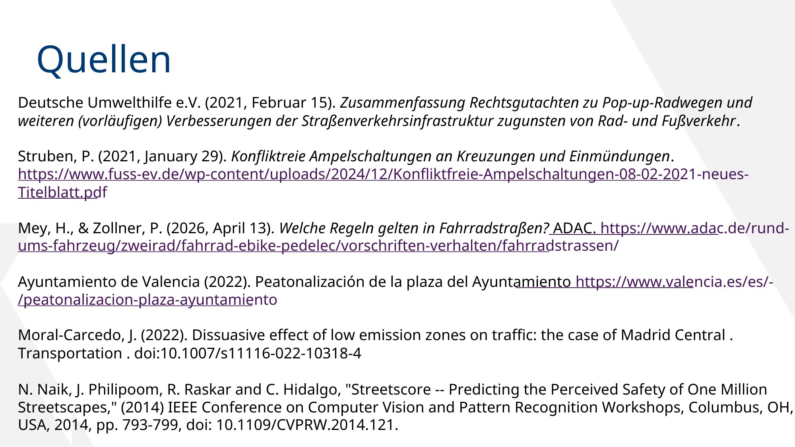

---

<!-- _class: pdf-page -->

